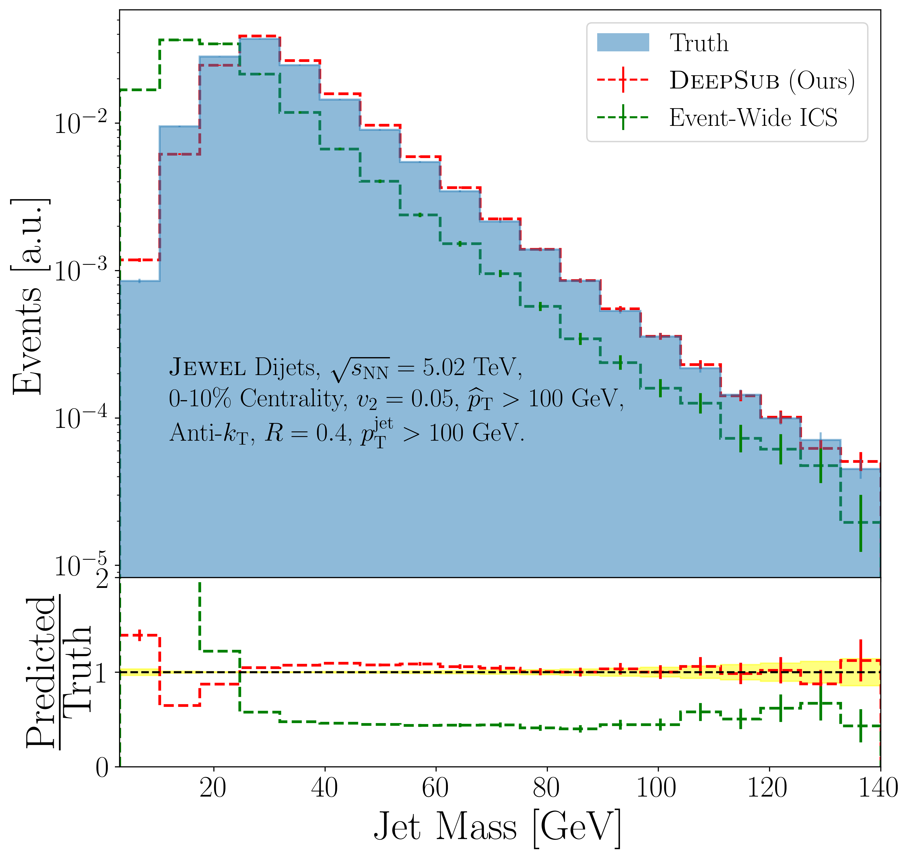
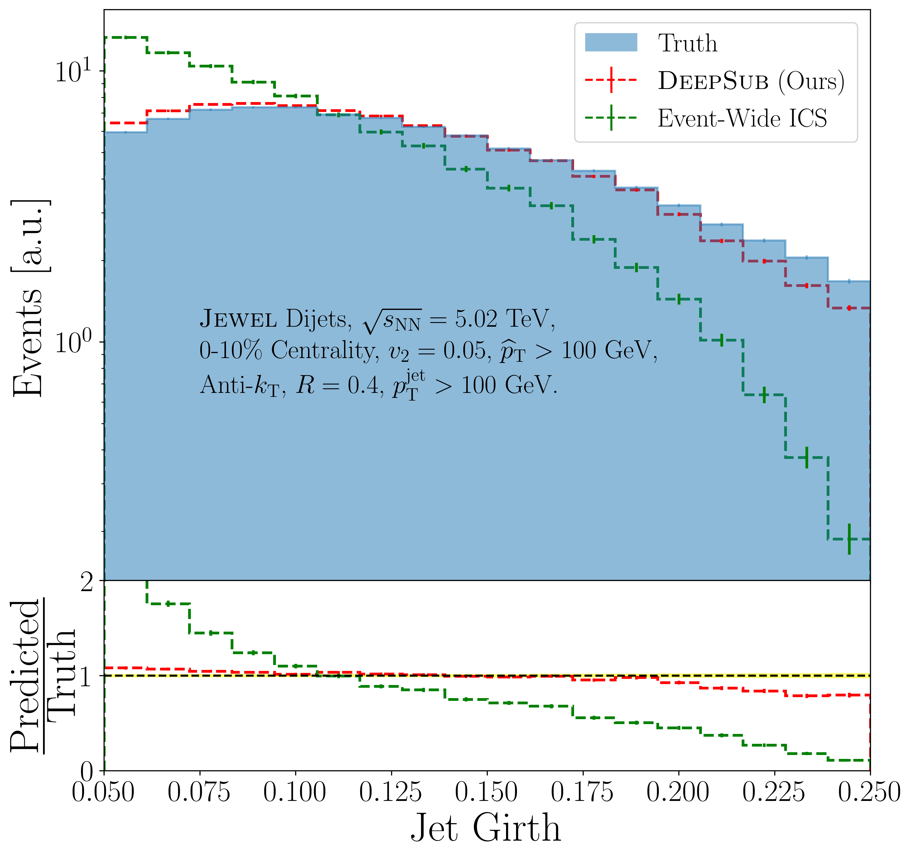
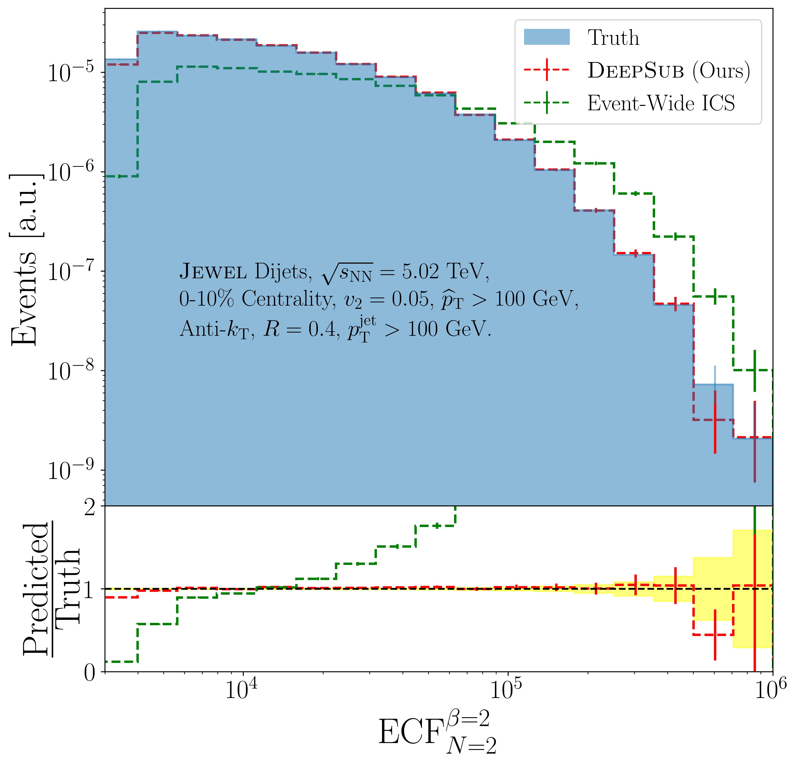

# DeepSub: Deep Learning for Thermal Background Subtraction in Heavy-Ion Collisions

<p align="center">
  
</p>

## Overview

This is the official repository for DeepSub, a novel deep learning approach for background subtraction in heavy-ion collisions. DeepSub employs a Swin Transformer-based architecture for image restoration to process jet images and separate the hard jet signal from the thermal background. The model is trained to preserve jet substructure observables while effectively removing the underlying event background.

## Abstract

Jet reconstruction in an ultra-relativistic heavy-ion collision suffers from a notoriously large thermal background. Traditional background subtraction methods struggle to remove this soft background while preserving the jet's hard substructure. In this study, we present DeepSub, the first machine learning-based approach for full-event background subtraction. DeepSub utilizes Swin Transformer layers to denoise jet images and effectively disentangle hard jets from the heavy-ion background. DeepSub significantly outperforms existing subtraction techniques on key observables, achieving sub-percent to percent-level closure on distributions of jet $p_\mathrm{T}$, mass, girth, and energy correlation functions. As such, DeepSub paves the way for precision measurements in heavy-ion collisions.

## Key Highlights

<p align="center">
  
  
</p>
<p align="center">
  
  
</p>


- First machine learning-based approach for full-event background subtraction.
- Utilizes Swin Transformer architecture for effective image processing.
- Achieves sub-percent to percent level closure on key jet observables:
  - Jet $p_\mathrm{T}$.
  - Jet mass.
  - Jet girth.
  - Energy correlation functions.
- As such, preserves jet substructure while removing thermal background.

## Preprocessed Data

The full dataset used in this study is available at DOI: [10.5281/zenodo.15674391](https://doi.org/10.5281/zenodo.15674391).

[](https://doi.org/10.5281/zenodo.15674391)


## Pre-trained Models

- Best model (based on validation loss) `models/best_model.pt` is saved in the models directory.

## Usage

1. Download preprocessed data:
   ```bash
   python download_data.py
   ```
   This will create the `datasets/` directory and download `train.pt`, `val.pt`, and `test.pt`.


2. Run the training:
   ```bash
   python train.py
   ```

3. Compute jet observables:
   ```bash
   python compute_obs.py
   ```
   This will load the test dataset and the trained model checkpoint `models/best_model`, and save NumPy arrays of truth and reconstructed observables in the `obs/` directory:
   - `obs/truth_pt.npy`
   - `obs/truth_mass.npy`
   - `obs/truth_girth.npy`
   - `obs/truth_ecf.npy`
   - `obs/reco_pt.npy`
   - `obs/reco_mass.npy`
   - `obs/reco_girth.npy`
   - `obs/reco_ecf.npy`

4. Generate comparison plots:
   ```bash
   python plot.py
   ```
   This reads the saved `.npy` files in `obs/` (including ICS arrays if present) and saves figure files to the `figs/` directory, for example:
   - `jetPT.png`
   - `jet_mass.png`
   - `jet_girth.png`
   - `ecf.png`

## Dependencies

- pytorch torchvision
- timm
- tqdm
- numpy

## Acknowledgements

This project is based on SwinTR ([paper](https://arxiv.org/abs/2103.14030), [code](https://github.com/microsoft/Swin-Transformer)) and SwinIR ([paper](https://arxiv.org/abs/2108.10257), [code](https://github.com/JingyunLiang/SwinIR)). Thanks for their outstanding work and code ❤️.
